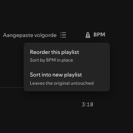

# Spicetify Sort BPM



DJ-style playlist tools for the Spotify desktop client, via [Spicetify](https://spicetify.app).

Right now it does one thing well: **sort a playlist by BPM (tempo)**.

A **BPM** button is added to the playlist action bar (between "Search in playlist" and the
sort/view button). Clicking it offers two options:

- **Reorder this playlist** — sorts the tracks by BPM in place. Preserves each track's
  "date added". Only works on playlists you own.
- **Sort into new playlist** — creates a new `"<name> (BPM)"` playlist sorted by BPM and
  leaves the original untouched (works on any playlist).

Tracks without BPM data (local files, podcasts, unavailable tracks) are moved to the end
rather than being sorted into a wrong position, and the count is reported.

> **Note:** the BPM values are read from the playlist's **BPM column**, so that column must be
> visible before sorting. If it isn't, enable it via the playlist's column/view settings
> (the "..." / column header menu). Without the BPM column showing, no BPM data can be read.

## Development

```sh
npm install
npm run watch      # rebuild on change into the Spicetify Extensions folder
# or
npm run build:local  # minified build into ./dist
npm run typecheck
npm run lint
```

## Install (local)

```sh
npm run build:local
# copy dist/sort-bpm.js to the Spicetify Extensions folder:
#   macOS/Linux: ~/.config/spicetify/Extensions
#   Windows:     %appdata%\spicetify\Extensions
spicetify config extensions sort-bpm.js
spicetify apply
```
